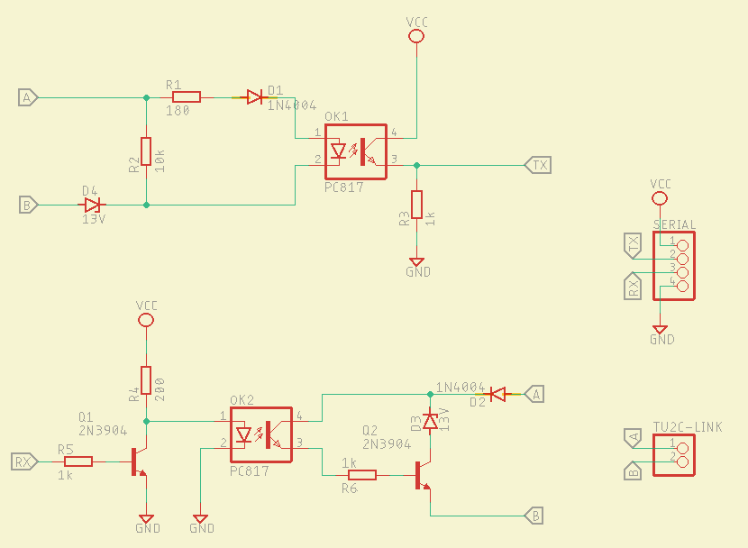
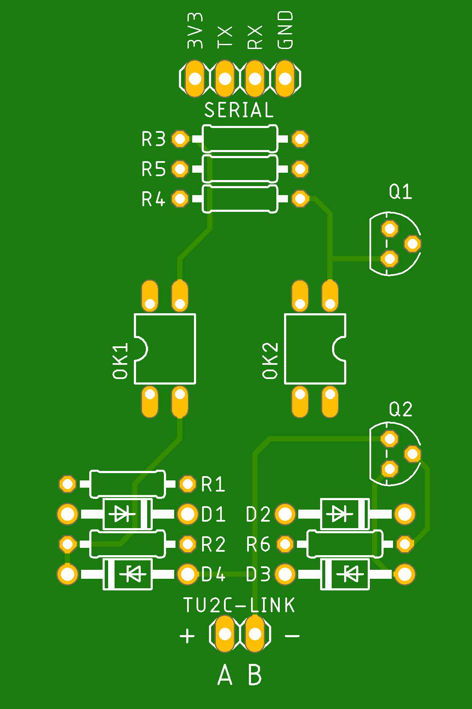
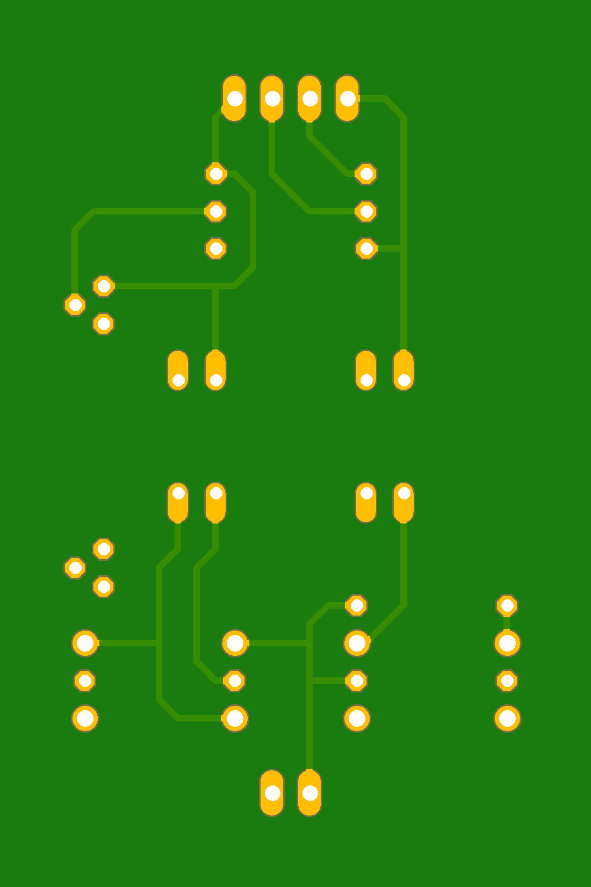

# Toshiba Estia R32 serial communication

## Hardware adapter

Hardware adapter for adjusting Toshiba AB protocol to 3.3V is taken from @issalig
[toshiba air conditioners project](https://github.com/issalig/toshiba_air_cond?tab=readme-ov-file#custom-hardware).  
**Note that `A` should by connected to positive and `B` to negative.**  

### Schematic

<div style = "max-width: 800px">
	 </br>
</div>


### Board

Board is designed to fit on a 4x6cm prototype board.
<div style = "max-width: 800px">
	 
</div>

## Microcontroller

Code is written to work on Arduino esp32 or Arduino esp8266.

### Dependencies
- Arduino core ([esp32](https://github.com/espressif/arduino-esp32) or [esp8266](https://github.com/esp8266/Arduino))
- [EspSoftwareSerial](https://github.com/plerup/espsoftwareserial)

## Implemented features
- heating on-off
- hot water on-off
- auto mode on-off
- quiet mode on-off
- night mode on-off
- forced defrost on-off
- heating temperature change
- hot water temperature change
- data requests

## To do
- cooling
- zone 2
- hot water boost
- anti bacteria
- frost protection
- errors history
- commands ack

## Config

I have 11kW model, so if there is default value depending on model 11kW is used.  

`config.h`
```c++
#define SENSORS_DATA_TO_REQUEST "tc", "twi", "two", "tho", "wf", "lps", "te", "to", "td", "ts", "tl", "cmp", "fan1", "pmv", "hps"
#define TOSHIBA_ESTIA_MODEL 11    // 4kW, 6kW, 8kW, 11kW
```

## Commands

### Set mode
mode: `auto`, `quiet`\*, `night`, `heating`, `hot_water`  
onOff: `1` | `0`
```c++
estiaSerial.setMode(std::string mode, uint8_t onOff);
```
\* quiet mode must be enabled in controller
### Set temperature

zone: `heating`, `hot_water`  
temperature: for heating `20-65`, for hot water `40-75`

```c++
estiaSerial.setTemperature(std::string zone, uint8_t temperature);
```
## Force defrost

Force defrost on next operation start (heating or hot water).
onOff: `1` | `0`

```c++
estiaSerial.forceDefrost(uint8_t onOff);
```
## Request data

### Request single data point
```c++
estiaSerial.requestData("twi");    // request data by name
estiaSerial.requestData(0x06);     // request data by code
```
### Request multiple data points at once

Default sensors data to request is defined in `config.h` -> `SENSORS_DATA_TO_REQUEST`.  
Data will be saved to `estiaSerial.sensorData`.

Data structure (`std::map`)  
```c++
// EstiaData::first = sensorName
// EstiaData::second = { value, multiplier }
{ std::string sensorName, { int16_t value, float multiplier }}
```
data value equal or below `-200` is an error code


```c++
if (estiaSerial.requestSensorsData()) {    // request update for all data points
	for (auto& element : estiaSerial.sensorData) {
		Serial.printf("%s :", element.first);
		// data is error code skip multiplier
		if (element.second.value <= EstiaSerial::err_not_exist) {
			Serial.print(element.second.value);
		} else {
			Serial.print(element.second.value * element.second.multiplier);
		}
		Serial.println();
	}
}
```
It is possible to update only few sensors.

```c++
if (estiaSerial.requestSensorsData({"twi", "two", "wf"})) {
	for (auto& element : estiaSerial.sensorData) {    // request update for chosen data points
		Serial.printf("%s :", element.first);
		// data is error code skip multiplier
		if (element.second.value <= EstiaSerial::err_not_exist) {
			Serial.print(element.second.value);
		} else {
			Serial.print(element.second.value * element.second.multiplier);
		}
		Serial.println();
	}
}

```


### Available data points

| name                  | code | multiplier | unit  | description                            |
|-----------------------|------|------------|-------|----------------------------------------|
| tc                    | 0x04 | x1         | °C    | condensedTemperature                   |
| twi                   | 0x06 | x1         | °C    | waterInletTemperature                  |
| two                   | 0x07 | x1         | °C    | waterOutletTemperature                 |
| tho                   | 0x08 | x1         | °C    | waterHeaterOutletTemperature           |
| tfi                   | 0x09 | x1         | °C    | floorInletTemperature                  |
| ttw                   | 0x0a | x1         | °C    | hotWaterTemperature                    |
| mix                   | 0x0b | x1         | step  | mixingValvePosition                    |
| lps                   | 0x0e | x1/10      | kPa   | lowPressure                            |
| sw_ver                | 0x0f | --         |       | softVersion                            |
| ctrl_hw_temp          | 0x10 | x1         | °C    | controlTemperatureHotWater             |
| ctrl_zone1_temp       | 0x11 | x1         | °C    | controlTemperatureZone1                |
| ctrl_zone2_temp       | 0x12 | x1         | °C    | controlTemperatureZone2                |
| wf                    | 0xc0 | x10        | l/min | water flow                             |
| te                    | 0x60 | x1         | °C    | heatExchangeTemperature                |
| to                    | 0x61 | x1         | °C    | outsideTemperature                     |
| td                    | 0x62 | x1         | °C    | dischargeTemperature                   |
| ts                    | 0x63 | x1         | °C    | suctionTemperature                     |
| ths                   | 0x65 | x1         | °C    | heatSinkTemperature                    |
| ct                    | 0x6a | x1/10      | A     | current                                |
| tl                    | 0x6d | x1         | °C    | heatExchangerCoilTemperature           |
| cmp                   | 0x70 | x1         | Hz    | compressorSpeed                        |
| fan1                  | 0x72 | x1         | RPM   | outdoorFan1RPM                         |
| fan2                  | 0x73 | x1         | RPM   | outdoorFan2RPM                         |
| pmv                   | 0x74 | x1/10      | pls   | outdoorPMVPosition                     |
| hps                   | 0x7a | x1/10      | kPa   | Ps highPressure                        |
| hp_on_time            | 0xf0 | x1/100     | h     | microComputerEnergizedAccumulationTime |
| hw_cmp_on_time        | 0xf1 | x1/100     | h     | hotWaterCompressorONAccumulationTime   |
| cool_cmp_on_time      | 0xf2 | x1/100     | h     | coolingCompressorONAccumulationTime    |
| heat_cmp_on_time      | 0xf3 | x1/100     | h     | heatingCompressorONAccumulationTime    |
| pump1_on_time         | 0xf4 | x1/100     | h     | pump1ONAccumulationTime                |
| hw_e_heater_on_time   | 0xf5 | x1/100     | h     | hotWaterEHeaterAccumulationTime        |
| backup_heater_on_time | 0xf6 | x1/100     | h     | backupEHeaterAccumulationTime          |
| boost_heater_on_time  | 0xf7 | x1/100     | h     | boosterEHeaterAccumulationTime         |

## Sniff communication

To get sniffed frame call `EstiaSerial::getSniffedFrame()`, this method returns FrameBuffer(std:vector)  
e.g. `{0xa0, 0x00, 0x10, 0x07, 0x00, 0x08, 0x00, 0x00, 0xfe, 0x00, 0x8a, 0x75, 0x05`.  
There is helper `EstiaFrame::stringify(const FrameBuffer& buffer)` to stringify data to hex string  
e.g. `a0 00 10 07 00 08 00 00 fe 00 8a 75 05`

```c++
switch (estiaSerial.sniffer()) {
	case EstiaSerial::sniff_frame_pending:
		Serial.println(EstiaFrame::stringify(estiaSerial.getSniffedFrame()));
		break;
}
```
Sniffer also decodes status frames. There is status data update flag available
`estiaSerial.newStatusData` to indicate if data was updated.

```c++
if (estiaSerial.newStatusData) {
	StatusData data = estiaSerial.getStatusData();
	printStatusData(data);
}
```
## [RAW frames](frames.md)

### Sending RAW frames

```c++
// heating on raw frame
estiaSerial.write({0xa0, 0x00, 0x11, 0x08, 0x00, 0x00, 0x40, 0x08, 0x00, 0x00, 0x41, 0x23, 0x8f, 0x38});
```
